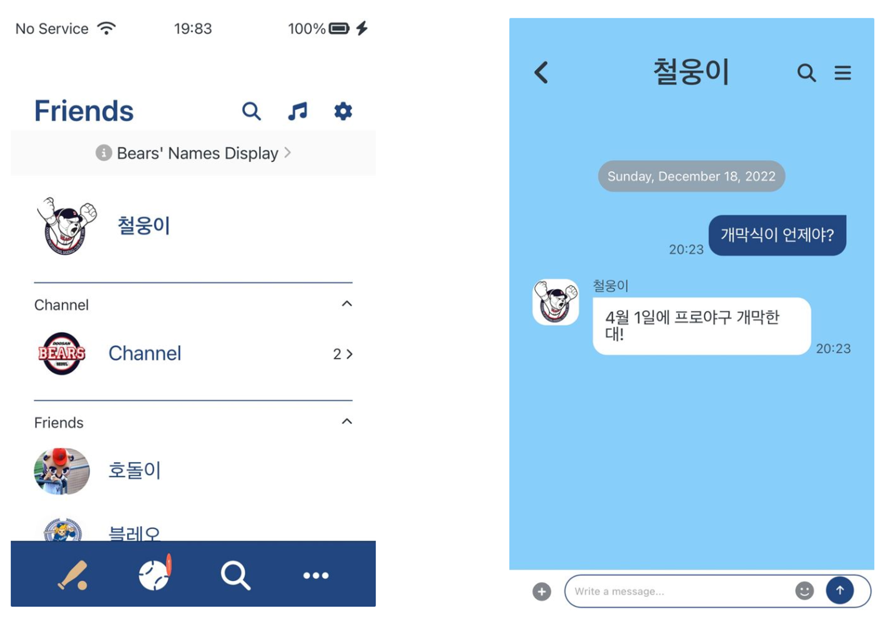

# KakaoTalk Clone Coding

## KaKaoTalk Web
> 개발 기간 : 2022.12.12-2022.12.25 

## Deploy
> https://yun0727.github.io/kokoa-clone-2022/

 

# 시작 가이드
## 요구사항
클론해서 실행하려고 할때 필요한 요구사항과 버전

## 설치 및 실행
레포지토리를 클론하고, 패키지 설치, 환경변수 설정, 실행하는 과정에 대한 내용을 코드로 적는다

# 03 기술 스택
사용한 기술 스택
Environment
Config
Development
Communication

# 04 주요 기능
프로젝트의 주요 기능 소개

# 05 아키텍처
프로젝트의 아키텍처와 디렉토리 구조에 대해 작성